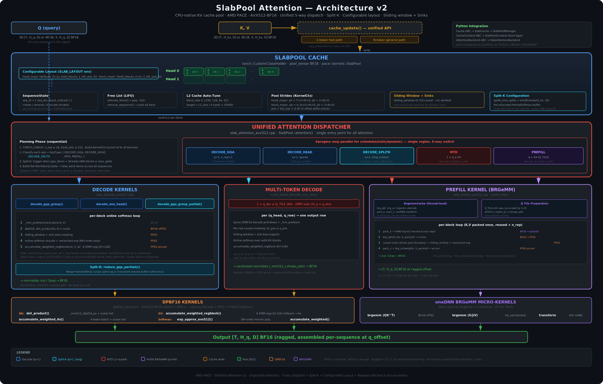

# SlabPool Attention

CPU-native KV cache pool for LLM serving on AMD EPYC (Zen4+).

## Contents

- [Overview](#overview)
- [Architecture](#architecture)
- [SlabPool Cache](#slabpool-cache)
  - [Pool Tensor](#pool-tensor)
  - [Block Allocation](#block-allocation)
  - [Pool Navigation](#pool-navigation)
  - [Block Size Auto-Tuning](#block-size-auto-tuning)
  - [Cache Update](#cache-update)
- [Python Integration](#python-integration)
- [Sequence Lifecycle](#sequence-lifecycle)
- [Attention Dispatch](#attention-dispatch)
- [Kernel Paths](#kernel-paths)
  - [Decode: Block-by-Block Online Softmax](#decode-block-by-block-online-softmax)
  - [Multi-Token Decode (MTD)](#multi-token-decode-mtd)
  - [BRGeMM Prefill](#brgemm-prefill)
- [Environment Variables](#environment-variables)

## Overview

SlabPool is a global KV cache that stores all sequences' key and value data in a single pre-allocated BF16 tensor. It operates as a unified C++ object (`torch::CustomClassHolder`) with a single entry point for all attention types: causal decode, multi-token decode, sliding window, sink attention, and BRGeMM-tiled prefill.

The pool uses a slab allocator with fixed-size blocks. Each block holds `block_size` tokens of K and V data for one KV head. Blocks are assigned to sequences on demand from a free list and returned when sequences complete. This avoids per-call memory allocation during inference and supports continuous batching where prefill and decode sequences coexist in the same batch.

## Architecture

<p align="center">
  
</p>

## SlabPool Cache

### Pool Tensor

The pool is a single contiguous BF16 tensor allocated at construction time. Its shape depends on the layout mode:

- **Head-major** (default): `[num_kv_heads, total_blocks, 2, block_size, head_dim]`
- **Block-major**: `[total_blocks, num_kv_heads, 2, block_size, head_dim]`

The `2` dimension stores K and V adjacently within each block. The total memory consumed is:

```
pool_bytes = total_blocks * num_kv_heads * 2 * block_size * head_dim * 2  (BF16 = 2 bytes)
```

For example, a Llama-3.1-8B configuration (num_kv_heads=8, head_dim=128, block_size=64) with 4096 blocks uses approximately 4096 * 8 * 2 * 64 * 128 * 2 = **16 GB**.

### Block Allocation

The pool maintains a free list (LIFO stack) of available block indices. When a sequence needs a new block (because its token count crosses a block boundary), a block is popped from the free list. When a sequence is removed, all its blocks are pushed back.

Each sequence tracks its blocks via a `block_indices` vector that maps logical block index (0, 1, 2, ...) to physical pool block index. Blocks are not necessarily contiguous in the pool — a sequence's data may be scattered across the tensor. This is by design: it avoids compaction and allows O(1) allocation/deallocation.

### Pool Navigation

Three stride variables define how to access data within the pool:

| Stride | Meaning | Head-major | Block-major |
|--------|---------|------------|-------------|
| `ph` | Elements between KV heads | `total_blocks * 2 * block_size * head_dim` | `2 * block_size * head_dim` |
| `pb` | Elements between blocks | `2 * block_size * head_dim` | `num_kv_heads * 2 * block_size * head_dim` |
| `pvo` | Elements from K to V within a block | `block_size * head_dim` | `block_size * head_dim` |

To locate the K and V data for KV head `h` at physical block `b`:

```cpp
const at::BFloat16* k_base = pool_ptr + h * ph + b * pb;
const at::BFloat16* v_base = k_base + pvo;
// k_base points to [block_size, head_dim] K data
// v_base points to [block_size, head_dim] V data
```

### Block Size Auto-Tuning

When `block_size` is not explicitly set via `SLAB_BLOCK_SIZE`, the Python integration auto-tunes it by reading the L2 cache size from sysfs and selecting the largest block size from {256, 128, 64, 32} such that one block's KV data fits within L2/4. This ensures that a single block's K and V data remain L2-resident during the attention computation.

Block size must be a multiple of 16 (required by BRGeMM sub-blocking) and at most 256 (limited by fixed-size score arrays in decode kernels).

### Cache Update

`cache_update` writes new KV data into the pool. It supports two input formats:

- **4D batched**: `[B, S, num_kv_heads, head_dim]` — standard transformer output
- **3D ragged**: `[total_tokens, num_kv_heads, head_dim]` with `token_counts` per sequence

A **single-token fast-path** activates when all sequences add exactly one token (the common decode case). This path skips OMP parallelization for small writes and uses an inline `copy_256B` AVX-512 function for head_dim=128, eliminating `memcpy` function call overhead.

For multi-token writes (prefill), the copy is parallelized with `schedule(static)` across `n_seq * num_kv_heads` work items, gated by a byte-size threshold (64KB) to avoid OMP fork/join overhead on small copies.

## Python Integration

The Python layer in `pace/llm/attention/slab/cache.py` provides three classes that sit between the model and the C++ pool:

### SlabCache

The engine-level cache backend. Implements the `Cache` ABC so it can be swapped in for any other cache type (BMC, Dynamic, Paged). It owns the `SlabPoolManager` and handles lazy or eager initialization:

- **Server path** (`kv_cache_memory_gb` provided): the pool is allocated eagerly at engine startup, before any requests arrive.
- **Offline path** (no memory budget): the pool is created lazily on the first `create_context()` call, sized from `max_seq_length * batch_size * 2`.

Key methods:
- `create_context(config, max_seq_length, **kwargs)` — creates sequences in the pool and returns a `SlabPoolContext`.
- `merge_contexts(contexts)` — combines per-sequence contexts into a single batched context for the model's forward pass.
- `remove_context(context)` — releases all pool blocks for the sequences in the context.

### SlabPoolManager

Creates one C++ `SlabPool` per transformer layer. Maps string-based request tokens (e.g., `"req-123"`) to internal integer sequence IDs. All layers share the same block size and pool sizing, but each layer has its own independent pool tensor.

The manager computes `total_blocks` from either a memory budget (`kv_cache_memory_gb`) or a token count (`max_total_tokens`), dividing evenly across layers.

### SlabPoolContext

A per-request cache context that the model receives during forward. It holds a list of token identifiers and delegates to the manager for cache operations. Indexing returns a **`SlabPoolLayerView`** per layer (`cache_context[layer_idx]` is equivalent to `cache_context.cache_objects[layer_idx]` in `pace/llm/attention/slab/cache.py`).

That layer view is the **Python** API used by `SlabAttentionBackend` and model code. It wraps the per-layer C++ `SlabPool` via `SlabPoolManager` and uses **`update`** / **`attend`**, not the low-level `cache_update` / `attention` names on the raw binding:

```python
# Inside the model's attention layer (SlabPoolLayerView — Python layer view):
layer_view = cache_context[layer_idx]
layer_view.update(keys, values, seq_lens=None)  # optional per-seq lengths (e.g. left padding)
output = layer_view.attend(
    query,
    scale,
    seq_lens=None,
    sliding_window=0,
    sinks=torch.tensor([]),
)
```

For batched decode in the server, multiple per-sequence contexts are merged into one via `merge_contexts`, so the underlying C++ **`SlabPool.attention`** still sees all sequences in a single call (via `SlabPoolManager.attention`).

## Sequence Lifecycle

The snippet below uses the **raw C++ pool** as exposed in Python: `torch.classes.pace.SlabPool` from `create_slab_pool(...)`. On that object the methods are named **`cache_update`**, **`attention`**, **`create_sequence`**, etc. — the same names documented in the following bullet list. Do not confuse this with **`SlabPoolLayerView.update` / `.attend`**, which are the higher-level wrappers used when the model receives a `SlabPoolContext`.

```python
from pace.llm.attention.slab.cache import create_slab_pool

pool = create_slab_pool(total_blocks=1024, num_kv_heads=8, head_dim=128, block_size=64)

# Register a sequence
pool.create_sequence(seq_id=0, max_seq_len=2048)

# Prefill: write KV for input tokens
pool.cache_update([0], keys, values, [])

# Decode loop: append one token per step
for step in range(decode_steps):
    pool.cache_update([0], k_new, v_new, [])
    output = pool.attention([0], query, [], [], scale, 0, torch.tensor([]))

# Cleanup: return all blocks to the free list
pool.remove_sequence(0)
```

**`torch.classes.pace.SlabPool` (C++ binding) API:**

- **`create_sequence(seq_id, max_seq_len)`** — registers a sequence and pre-reserves vector capacity for block indices.
- **`cache_update(seq_ids, keys, values, token_counts)`** — writes KV data into pool blocks. Allocates new blocks as needed.
- **`attention(seq_ids, query, query_lens, q_start_offsets, scale, sliding_window, sinks)`** — computes attention for all sequences in one call. Supports 3D ragged and 4D batched query input. Pass `[]` for `q_start_offsets` (computed internally for 4D input).
- **`remove_sequence(seq_id)`** — returns all blocks to the free list and erases the sequence.
- **`truncate_sequence(seq_id, remove_len)`** — removes tokens from the end of a sequence, freeing blocks that are no longer needed.

## Attention Dispatch

The dispatcher in `slab_attention_avx512.cpp` handles all attention types in a single function across three phases.

### Phase 1: Classify Sequences

Each sequence is classified by its query length:

| Query Length | Type | Description |
|---|---|---|
| `q_len == 1` | Decode | GQA, HEAD, or Split-K (heuristic selects) |
| `1 < q_len <= 64` | Multi-Token Decode | Per-(q_head, q_row) dot-product attention |
| `q_len > 64` | Prefill | BRGeMM-tiled matrix attention |

For decode, the sub-strategy depends on thread utilization:

- **DECODE_GQA**: One work item per KV head. All `n_rep` Q heads share a single KV read per block. Preferred when `gqa_items >= num_threads / 2`.
- **DECODE_HEAD**: One work item per Q head. More parallelism but redundant KV reads. Used when GQA items are too few.
- **DECODE_SPLITK**: GQA with block-range splitting. Each split produces a `PartialSoftmax` that is merged after the parallel region. Triggered when GQA items are close to `num_threads` and KV is long enough (sp >= 4).

### Phase 2: Build Work Items

A flat work-item table is constructed where each entry is one unit of parallel work:

| Type | Work Item | Count per sequence |
|------|-----------|-------------------|
| DECODE_GQA | (seq, kv_h) | num_kv |
| DECODE_HEAD | (seq, qh) | num_q_heads |
| DECODE_SPLITK | (seq, kv_h, split) | num_kv * splits |
| MTD | (seq, qh, q_row) | num_q_heads * q_len |
| PREFILL | (seq, kv_h, q_tile) | num_kv * ceil(q_len / 64) |

### Phase 3: OMP Dispatch

Work items execute in a single `#pragma omp parallel for` region with adaptive scheduling:

- **`schedule(static)`** when `total_work <= num_threads` — each thread gets at most one item, zero atomic contention.
- **`schedule(dynamic)`** when `total_work > num_threads` — balances uneven completion times.
- **Always dynamic** for mixed decode + prefill batches.

## Kernel Paths

### Decode: Block-by-Block Online Softmax

Decode processes one query token against all KV blocks using online softmax. No full score matrix is materialized.

For each block:

1. **QK scoring**: Dot product between the query and each K token using the AVX512-BF16 `vdpbf16ps` instruction.

2. **Online softmax update**: If the block's max score exceeds the running max, the accumulated output and sum are rescaled by `exp(old_max - new_max)`.

3. **Exp weights**: Vectorized exp computes 16 values at a time using a 6th-order Horner polynomial. A vertical accumulate produces the sum with a single horizontal reduction at the end.

4. **SV accumulation**: For head_dim=128, the output lives in 8 ZMM registers across all tokens in the block — loaded once, stored once. For other head dimensions, a 4x-batched fallback reduces load/store traffic by 4x.

5. **Prefetch**: The next block's K and V addresses are prefetched to L1.

The GQA variant loads K/V once per block and computes scores for all `n_rep` Q heads, reducing memory bandwidth by `n_rep`x.

### Multi-Token Decode (MTD)

MTD handles sequences with 2-64 query tokens. Each (q_head, q_row) pair is one work item. The kernel is identical to single-token decode but applies a causal mask based on each row's position: `q_pos = q_row + (kv_len - q_len)`.

### BRGeMM Prefill

Prefill handles sequences with more than 64 query tokens using oneDNN BRGeMM micro-kernels.

The query is split into tiles of 64 rows. For each (kv_head, q_tile) work item:

1. **Q tile prep**: Query data copied with pre-applied scale to avoid per-score scaling.
2. **Block loop**: For each KV block, pack K into VNNI layout (once per block, reused across `n_rep` heads), compute QK^T via BRGeMM, apply causal mask, run online softmax, pack V, compute weighted SV via BRGeMM.
3. **Normalize**: FP32 output divided by softmax sum, converted to BF16.

A thread-local `BrgemmCache` lazily initializes and caches the BRGeMM ukernel objects and working buffers, keyed by (tile_q, block_size, head_dim).

## Environment Variables

| Variable | Default | Description |
|----------|---------|-------------|
| `SLAB_BLOCK_SIZE` | auto-tuned from L2 | Block size (must be multiple of 16, max 256) |
| `SLAB_LAYOUT` | `head_major` | Pool layout: `head_major` or `block_major` |
| `SLAB_SCHEDULE` | auto | OMP scheduling override: `static` or `dynamic` |
| `SLAB_MAX_SPLITS` | auto from threads/heads | Maximum Split-K splits |
